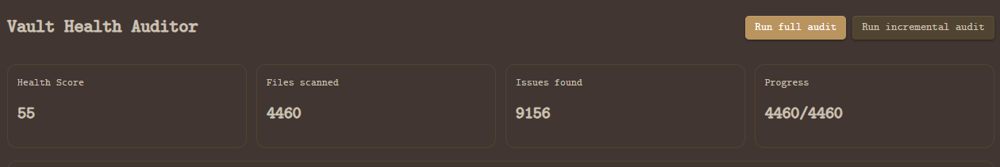
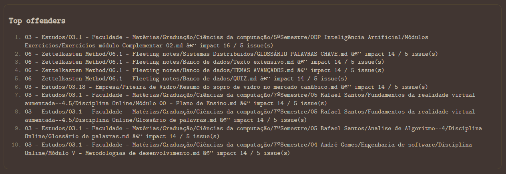
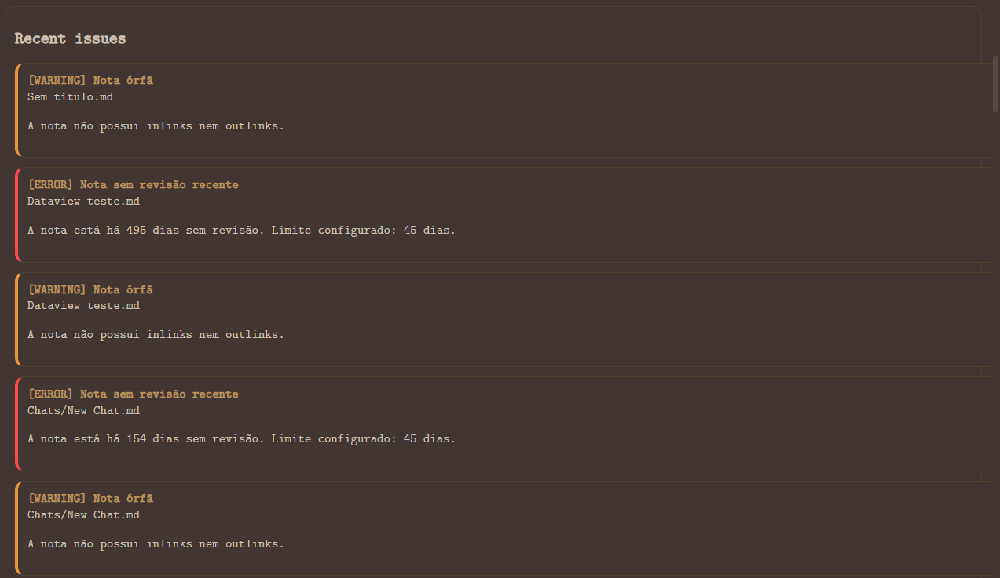

# Vault Health Auditor

<p align="center">
  Plugin para Obsidian focado em <strong>manutenção ativa do vault</strong>, <strong>qualidade estrutural das notas</strong> e <strong>redução de dívida de conhecimento</strong>.
</p>

<p align="center">
  
  
  
  
  
</p>

---

## Overview

Com o crescimento natural de um vault no Obsidian, surgem problemas recorrentes:

- notas antigas nunca mais revisitadas
- links quebrados ou sem contexto
- notas órfãs sem conexão com o restante do conhecimento
- frontmatter inconsistente entre tipos de nota
- notas grandes demais sem headings
- páginas “depósito” com excesso de links e pouca estrutura
- resumos ausentes
- claims sem referência ou suporte

O **Vault Health Auditor** transforma esse problema de manutenção em uma **auditoria ativa**, com regras objetivas, score consolidado e um dashboard de diagnóstico do vault.

---

## What this plugin helps with

O plugin ajuda você a:

- medir a saúde geral do vault
- identificar notas negligenciadas
- detectar links quebrados e links fracos
- encontrar notas órfãs
- validar frontmatter obrigatório por tipo de nota
- localizar notas longas sem estrutura adequada
- detectar páginas com características de “dump page”
- encontrar notas que deveriam ter resumo e não têm
- sinalizar afirmações potencialmente sem fonte
- acompanhar a evolução da qualidade do vault ao longo do tempo

---

## Main Features

### Full Vault Audit
Executa uma auditoria completa em todos os arquivos Markdown do vault e gera um resultado consolidado.

### Incremental Audit
Monitora alterações no vault e reavalia apenas as notas modificadas, reduzindo custo em vaults grandes.

### Vault Health Score
Gera um **score global de saúde** do vault em escala de `0 a 100`, calculado a partir do impacto das issues encontradas.

### Severity Breakdown
Agrupa issues por severidade:

- `info`
- `warning`
- `error`
- `critical`

### Category Scores
Divide o score por categorias de qualidade:

- `freshness`
- `links`
- `structure`
- `metadata`
- `knowledge-quality`

### Top Offenders
Mostra as notas com maior impacto negativo no vault.

### Recent Issues
Exibe as issues mais recentes detectadas durante a auditoria.

### Audit History
Armazena histórico resumido das execuções para acompanhar evolução do score ao longo do tempo.

---

## Audit Rules

Atualmente, o plugin implementa as seguintes regras:

### 1. Note Age
Detecta notas sem revisão recente com base em:

- campo customizado de revisão (`reviewed_at`)
- ou data de modificação do arquivo (`mtime`) como fallback

### 2. Broken Links
Detecta:

- links não resolvidos
- links fracos ou isolados, com pouco contexto

### 3. Orphan Notes
Detecta notas sem:

- inlinks
- outlinks

### 4. Required Frontmatter
Valida campos obrigatórios com base no tipo da nota.

Exemplo:

```yaml
type: book
````

Pode exigir:

* `author`
* `year`
* `status`

### 5. Large Unstructured Notes

Detecta notas grandes com pouca estrutura, especialmente quando há muito conteúdo e poucos headings.

### 6. Dump Pages

Detecta páginas com excesso de links e pouca organização textual, sugerindo acúmulo sem curadoria.

### 7. Missing Summary

Detecta notas que, segundo a política configurada, deveriam conter resumo e não contêm.

### 8. Unsupported Claims

Aplica uma heurística para detectar frases assertivas que aparentam não possuir suporte, link ou referência próxima.

> Observação: esta análise é heurística e não substitui revisão humana.

---

## Dashboard

O dashboard atual exibe:

* **Health Score**
* **Files scanned**
* **Issues found**
* **Progress**
* **Severity breakdown**
* **Category scores**
* **Top offenders**
* **Recent issues**
* **Audit history**

---

## Screenshots

Adicione aqui as screenshots do dashboard para tornar o repositório mais apresentável.

Exemplo:

```md



```

Sugestão de pasta:

```text
assets/
├─ dashboard-overview.png
├─ top-offenders.png
└─ recent-issues.png
```

---

## Current Architecture

O projeto foi organizado em camadas para facilitar manutenção, testes e evolução do plugin.

### Architecture Layers

* **core/** → motor de auditoria, scheduler, snapshots, persistência
* **rules/** → regras de auditoria
* **analyzers/** → heurísticas de markdown e análise semântica
* **scoring/** → cálculo do score de saúde
* **ui/** → dashboard e settings
* **commands/** → comandos do Obsidian
* **persistence/** → normalização e armazenamento dos resultados
* **utils/** → helpers compartilhados
* **tests/** → testes unitários

---

## Project Structure

```text
vault-health-auditor/
├─ src/
│  ├─ main.ts
│  ├─ constants.ts
│  ├─ types/
│  │  ├─ audit.ts
│  │  ├─ score.ts
│  │  ├─ settings.ts
│  │  └─ snapshot.ts
│  ├─ core/
│  │  ├─ AuditEngine.ts
│  │  ├─ RuleRegistry.ts
│  │  ├─ SnapshotBuilder.ts
│  │  ├─ IncrementalIndexer.ts
│  │  ├─ Scheduler.ts
│  │  └─ AuditRepository.ts
│  ├─ rules/
│  │  ├─ NoteAgeRule.ts
│  │  ├─ BrokenLinksRule.ts
│  │  ├─ OrphanNoteRule.ts
│  │  ├─ RequiredFrontmatterRule.ts
│  │  ├─ LargeUnstructuredNoteRule.ts
│  │  ├─ DumpPageRule.ts
│  │  ├─ MissingSummaryRule.ts
│  │  └─ UnsupportedClaimsRule.ts
│  ├─ scoring/
│  │  ├─ HealthScoreService.ts
│  │  └─ ScoreWeights.ts
│  ├─ analyzers/
│  │  ├─ MarkdownStructureAnalyzer.ts
│  │  ├─ LinkStrengthAnalyzer.ts
│  │  ├─ ClaimDetector.ts
│  │  └─ FrontmatterPolicyMatcher.ts
│  ├─ ui/
│  │  ├─ views/
│  │  │  ├─ DashboardView.ts
│  │  │  └─ viewType.ts
│  │  ├─ components/
│  │  │  ├─ DashboardApp.svelte
│  │  │  ├─ ScoreCard.svelte
│  │  │  ├─ IssueTable.svelte
│  │  │  ├─ TrendChart.svelte
│  │  │  └─ FiltersPanel.svelte
│  │  ├─ settings/
│  │  │  └─ VaultHealthSettingTab.ts
│  │  └─ stores/
│  │     ├─ dashboardStore.ts
│  │     └─ settingsStore.ts
│  ├─ commands/
│  │  ├─ openDashboard.ts
│  │  ├─ runFullAudit.ts
│  │  └─ runIncrementalAudit.ts
│  ├─ persistence/
│  │  ├─ dataMappers.ts
│  │  └─ storageSchema.ts
│  └─ utils/
│     ├─ markdown.ts
│     ├─ time.ts
│     ├─ path.ts
│     ├─ batch.ts
│     └─ logger.ts
├─ tests/
│  ├─ unit/
│  ├─ fixtures/
│  └─ mocks/
├─ .github/workflows/
├─ manifest.json
├─ versions.json
├─ package.json
├─ tsconfig.json
├─ esbuild.config.mjs
├─ styles.css
├─ README.md
└─ LICENSE
```

---

## Tech Stack

* **TypeScript**
* **Obsidian API**
* **esbuild**
* **Vitest**
* **GitHub Actions**

---

## Installation for Development

Clone o repositório:

```bash
git clone https://github.com/RafaelPulzi/vault-health-auditor.git
cd vault-health-auditor
npm install
```

### Development Build

```bash
npm run dev
```

### Production Build

```bash
npm run build
```

### Type Checking

```bash
npm run lint
```

### Unit Tests

```bash
npm run test:run
```

---

## Local Obsidian Setup

Para testar o plugin localmente, coloque o projeto em:

```text
<YOUR_VAULT>/.obsidian/plugins/vault-health-auditor
```

Depois, garanta que existam na raiz da pasta do plugin:

* `main.js`
* `manifest.json`
* `styles.css`

Em seguida:

1. abra o vault no Obsidian
2. recarregue o app
3. vá em **Settings → Community plugins**
4. ative o plugin

---

## Commands

O plugin expõe os seguintes comandos:

* `Open audit dashboard`
* `Run full audit`
* `Run incremental audit`

---

## Settings

Atualmente o plugin oferece configuração para:

* execução automática de full audit no startup
* campo customizado de revisão (`reviewed_at`)
* tamanho dos batches
* threshold para notas grandes
* políticas por tipo de nota
* pastas ignoradas
* tags ignoradas

---

## Example Use Cases

Este plugin é especialmente útil para:

* vaults grandes de PKM
* sistemas baseados em Zettelkasten
* coleções acadêmicas de notas
* vaults de estudo com muitos backlinks
* ambientes em que consistência de frontmatter importa
* manutenção contínua de conhecimento a longo prazo

---

## Safety

O **Vault Health Auditor** atualmente é um plugin de **auditoria somente leitura**.

Ele:

* lê notas do vault
* lê metadados
* calcula métricas
* gera issues
* salva resultados da auditoria internamente

Ele **não modifica suas notas**.

---

## Current Limitations

Estado atual do projeto:

* o dashboard ainda é baseado em DOM manual
* os componentes Svelte ainda não estão integrados como UI principal
* a detecção de claims sem suporte é heurística
* não há autofix
* ainda não há filtros avançados por pasta, tag ou tipo diretamente no dashboard
* a experiência visual do dashboard ainda pode ser evoluída

---

## Roadmap

Melhorias planejadas:

* autofix para frontmatter ausente
* filtros por pasta, tag e tipo de nota
* score por pasta / domínio
* dashboard mais rico e interativo
* evolução da análise semântica
* sugestões de remediação por nota
* gráficos melhores para evolução do score
* UI final mais refinada com componentes dedicados

---

## Contributing

Contribuições são bem-vindas.

Áreas interessantes para contribuir:

* novas regras de auditoria
* refinamento de heurísticas
* performance em vaults grandes
* cobertura de testes
* experiência do dashboard
* documentação

Fluxo sugerido:

1. faça um fork
2. crie uma branch
3. implemente a melhoria
4. rode lint, tests e build
5. abra um pull request

---

## Development Notes

Durante o desenvolvimento, o fluxo recomendado é:

```bash
npm install
npm run lint
npm run test:run
npm run build
npm run dev
```

Isso garante:

* tipagem correta
* testes verdes
* bundle válido
* watch ativo para desenvolvimento no Obsidian

---

## GitHub Setup Suggestions

Sugestão de descrição curta para o repositório:

> Obsidian plugin for vault maintenance, knowledge auditing, and PKM quality tracking.

Sugestão de topics/tags no GitHub:

* `obsidian`
* `obsidian-plugin`
* `typescript`
* `pkm`
* `zettelkasten`
* `knowledge-management`
* `note-taking`
* `productivity`
* `vault-audit`
* `markdown`

---

## Release Notes Strategy

Para futuras releases, recomenda-se:

* manter `manifest.json` atualizado
* manter `versions.json` sincronizado
* gerar `main.js` em build de release
* publicar release via GitHub Actions
* usar tags semânticas como:

  * `0.1.0`
  * `0.2.0`
  * `1.0.0`

---

## Why this project matters

A maioria dos vaults cresce sem um sistema real de governança.
Com o tempo, isso cria desordem estrutural, perda de contexto e notas que deixam de contribuir para o sistema de conhecimento.

O **Vault Health Auditor** propõe uma abordagem diferente:

> tratar manutenção de conhecimento como algo mensurável, auditável e continuamente observável.

---

## Author

**Rafael Atala Pulzi**

* GitHub: [@RafaelPulzi](https://github.com/RafaelPulzi)

---

## License

MIT

